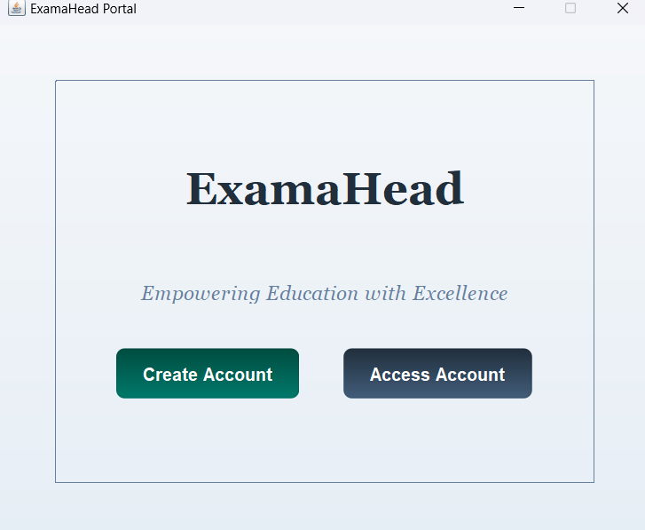
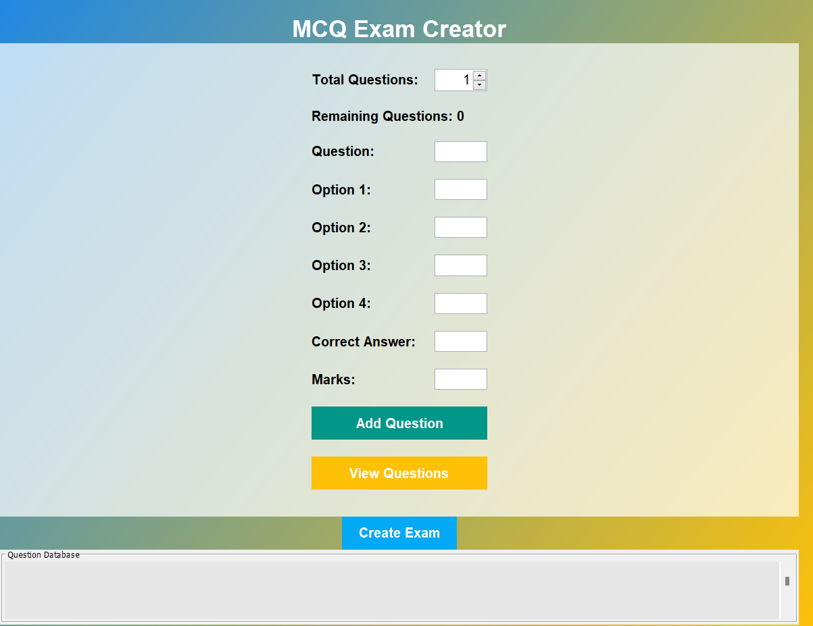
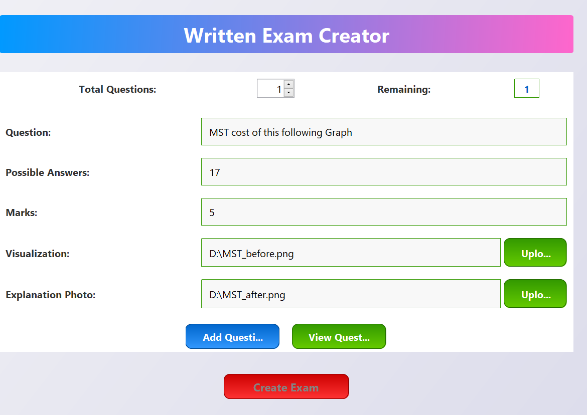
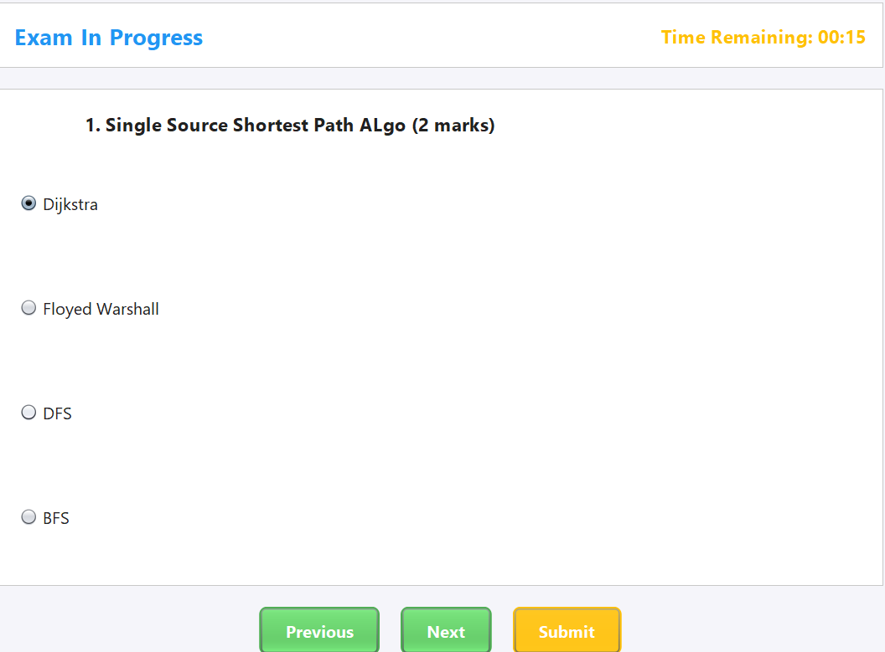
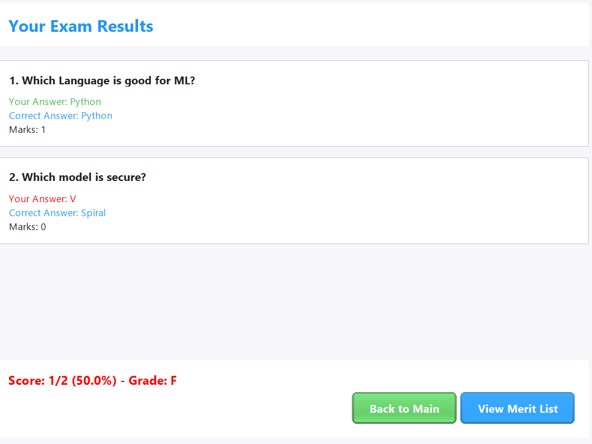
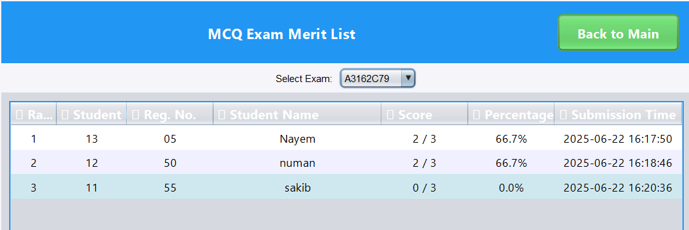
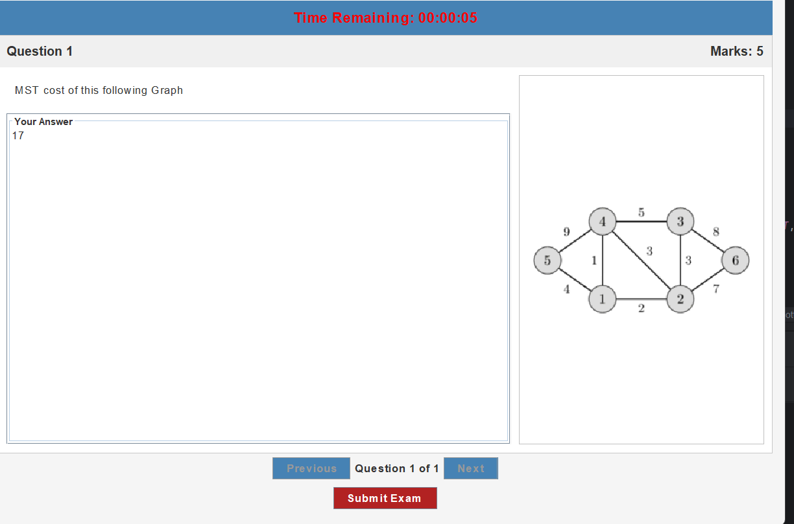
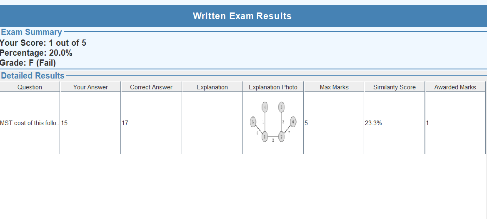
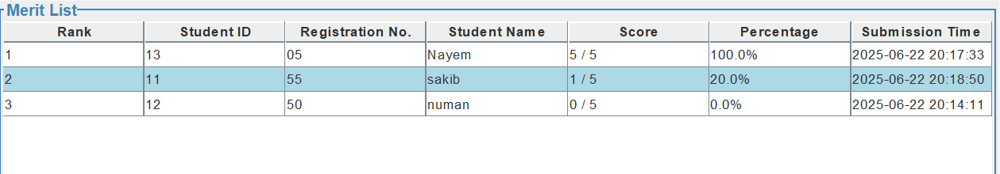

# ExamaHead

**ExamaHead** is a full-featured online examination system built using Java and MySQL, designed for both **examiners** and **examinees**. It allows examiners to create, manage, and evaluate both MCQ and written exams, and enables students to participate using a unique exam code sent via email or WhatsApp.

---

## 🎯 Features

### 👨‍🏫 For Examiners
- Create MCQ or written exams
- Set questions, time limits, and instructions
- Share exam codes via Email/WhatsApp
- Automatically generate results and merit lists

### 🧑‍🎓 For Examinees
- Join exams using a unique exam code
- Attempt both MCQ and written questions
- Submit answers within the allocated time
- View results and merit rankings after submission

---

## 💻 Tech Stack

- **Java (JDK 17)** – Core application
- **JDBC** – Database connectivity
- **MySQL** – Backend database
- **Swing (optional)** – For desktop UI
- **JavaMail API / WhatsApp link** – For sending exam invitations

---

## ⚙️ How to Run (3 Easy Steps)

1. **Clone the repository**

git clone https://github.com/your-username/ExamaHead22.git
cd ExamaHead22
Set up the MySQL database

Import schema.sql into your MySQL server

Update config.properties or DB config in the code with your MySQL credentials

Open and run in IntelliJ

Open the project in IntelliJ IDEA

Build and run the Main class or your app’s entry point
## 📸 Screenshots

### 🏠 Home Page  
**Filename**: `homepage.png`  
📌 *Landing page with options for login and exam access.*  

---

### 🛠️ MCQ Exam Creation Interface  
**Filename**: `mcqexamcreation.png`  
📌 *Examiners can create multiple-choice questions, set timer, and share exam code.*  

---

### ✍️ Written Exam Creation Interface  
**Filename**: `writtenexamcreation.png` 
📌 *Create long-answer written exams with individual question boxes.*  

---

### 🧑‍🎓 MCQ Exam Window (Student View)  
**Filename**: `mcqexamwindow.png`  
📌 *Students take MCQ exams with timer and navigation between questions.*  

---

### 📊 MCQ Result Sheet  
**Filename**: `mcqexamresult.png`  
📌 *Individual performance report after MCQ exam completion.*  

---

### 🏅 MCQ Merit List  
**Filename**: `mcqexammeritlist.png`  
📌 *Ranked list based on total scores of MCQ participants.*  

---

### 🖊️ Written Exam Window (Student View)  
**Filename**: `writtenexamwindow.png`  
📌 *Students write descriptive answers for each question in a scrollable layout.*  

---

### 📈 Written Exam Result Sheet  
**Filename**: `writtenexamresult.png`  
📌 *Evaluated responses and assigned marks visible to students.*  

---

### 🏆 Written Exam Merit List  
**Filename**: `writtenexammeritlist.png`  
📌 *Top performers list sorted by written exam scores.*  

🚀 Future Improvements
Add webcam-based cheating prevention

Export results to PDF or Excel

Web-based version with Spring Boot or Django

🧑‍💻 Author
Your Name – @Fahmid Zaman
