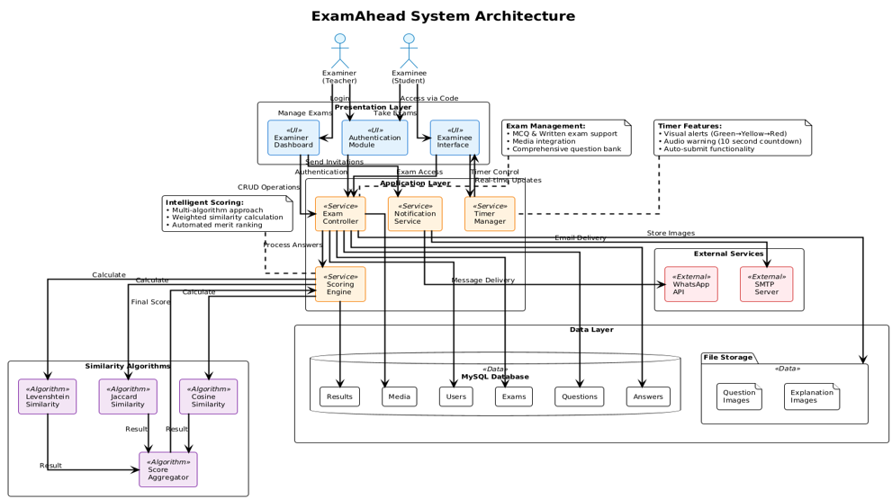

# ExamaHead

**ExamaHead** is a comprehensive online examination system built using Java and MySQL, designed to serve both **examiners** and **examinees**. The platform enables examiners to create, manage, and evaluate both MCQ and written examinations, while allowing students to participate seamlessly using unique exam codes delivered via email or WhatsApp.

---

## 🎯 Key Features

### 👨‍🏫 For Examiners
- **Exam Creation**: Design both MCQ and written examinations with customizable settings
- **Question Management**: Set questions, configure time limits, and provide detailed instructions
- **Code Distribution**: Share exam access codes via Email and WhatsApp integration
- **Automated Evaluation**: Generate results and merit lists automatically upon exam completion

### 🧑‍🎓 For Examinees
- **Easy Access**: Join examinations using unique exam codes
- **Flexible Testing**: Attempt both multiple-choice and written questions
- **Timed Submissions**: Complete assessments within allocated time frames
- **Performance Tracking**: View individual results and merit rankings post-submission

---

## 💻 Technology Stack

| Component | Technology |
|-----------|------------|
| **Core Application** | Java (JDK 17) |
| **Database Connectivity** | JDBC |
| **Backend Database** | MySQL |
| **Desktop UI** | Swing (optional) |
| **Communication** | JavaMail API / WhatsApp Integration |

---

## 🏗️ System Architecture

The ExamaHead architecture follows a modular and scalable design philosophy, maintaining clear separation of concerns across all components. The system ensures seamless communication between different modules through well-defined interfaces, making it highly extensible for future enhancements.

### 📐 System Design Overview

**Architecture Diagram**: `systemarchitecture.png`



📌 *The diagram illustrates the comprehensive interaction flow between UI components, Controller layer, Database management, and Communication modules.*

This robust architecture foundation enables easy integration of advanced features such as proctoring capabilities or web-based deployment in future iterations.

---

## ⚙️ Installation & Setup

### Prerequisites
- Java Development Kit (JDK 17 or higher)
- MySQL Server
- IntelliJ IDEA or preferred IDE

### Quick Start Guide

1. **Repository Setup**
   ```bash
   git clone https://github.com/your-username/ExamaHead22.git
   cd ExamaHead22
   ```

2. **Database Configuration**
   - Import `schema.sql` into your MySQL server
   - Update `config.properties` or database configuration in the code with your MySQL credentials

3. **Application Launch**
   - Open the project in IntelliJ IDEA
   - Build and run the Main class or your application's entry point

---

## 📸 Application Screenshots

### 🏠 Home Page
**Filename**: `homepage.png`  
📌 *Landing page featuring login options and exam access portal*


---

### 🛠️ MCQ Exam Creation Interface
**Filename**: `mcqexamcreation.png`  
📌 *Comprehensive interface for creating multiple-choice questions with timer settings and exam code sharing*


---

### ✍️ Written Exam Creation Interface
**Filename**: `writtenexamcreation.png`  
📌 *Dedicated workspace for designing long-answer written examinations with individual question containers*


---

### 🧑‍🎓 MCQ Exam Window (Student View)
**Filename**: `mcqexamwindow.png`  
📌 *Student interface featuring timer functionality and seamless question navigation*


---

### 📊 MCQ Result Sheet
**Filename**: `mcqexamresult.png`  
📌 *Detailed individual performance report displayed upon MCQ exam completion*


---

### 🏅 MCQ Merit List
**Filename**: `mcqexammeritlist.png`  
📌 *Comprehensive ranking system based on total scores of MCQ participants*


---

### 🖊️ Written Exam Window (Student View)
**Filename**: `writtenexamwindow.png`  
📌 *User-friendly interface for composing descriptive answers with scrollable layout design*


---

### 📈 Written Exam Result Sheet
**Filename**: `writtenexamresult.png`  
📌 *Detailed evaluation display showing assessed responses and assigned marks*


---

### 🏆 Written Exam Merit List
**Filename**: `writtenexammeritlist.png`  
📌 *Performance leaderboard showcasing top performers ranked by written exam scores*


---

## 🚀 Future Enhancements

- **Security Features**: Implement webcam-based cheating prevention mechanisms
- **Export Capabilities**: Add PDF and Excel export functionality for results
- **Web Platform**: Develop web-based version using Spring Boot or Django framework
- **Advanced Analytics**: Integrate comprehensive performance analytics and reporting
- **Mobile Support**: Create responsive mobile applications for enhanced accessibility

---

## 🧑‍💻 Author

**Fahmid Zaman** – [@Fahmid Zaman](https://github.com/your-username)

---


## 🤝 Contributing

Contributions, issues, and feature requests are welcome! Feel free to check the [issues page](https://github.com/your-username/ExamaHead22/issues) for open tasks.

---

## ⭐ Support

If you found this project helpful, please consider giving it a star on GitHub!
